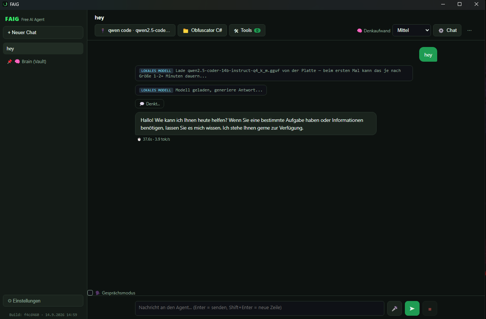

# FAIG — Free AI Agent

Ein Agent als Desktop-App. Das Sprachmodell läuft entweder lokal auf der eigenen
Grafikkarte oder über einen Anbieter deiner Wahl. Kein Terminal, kein Abo-Zwang,
kein fest eingebauter Anbieter.



## Was die App kann

- **Lokale Modelle**: GGUF-Dateien über llama.cpp, mit Ladefortschritt und VRAM-Anzeige
- **Fremde Anbieter**: alles mit OpenAI-kompatibler API, dazu das native Anthropic-Format
- **Werkzeuge**: Dateien lesen und schreiben, Shell, Websuche, Browser, PDF,
  E-Mail-Entwurf, Obsidian-Notizen, ComfyUI-Workflows
- **Mehrere Chats**: jeder mit eigenem Modell, eigenem Projektordner, eigenen Einstellungen
- **Gesprächsmodus**: Sprache rein, Sprache raus, alles lokal

## Starten

```bash
npm install
npm start
```

Windows-Anwendung bauen:

```bash
npm run build
```

## Einrichten

1. **Einstellungen** öffnen
2. Verbindung anlegen:
   - *Lokal*: Ordner mit den `.gguf`-Dateien wählen
   - *Anbieter*: Basis-URL und API-Schlüssel eintragen
3. Oben im Chat Modell und Projektordner wählen

Ein Chat-Abo bei einem Anbieter ist kein API-Schlüssel. API-Zugriff wird getrennt
abgerechnet und braucht einen eigenen Schlüssel.

## Sicherheit

- Schlüssel und Einstellungen liegen unverschlüsselt im Benutzerordner der App
- Das Shell-Werkzeug ist standardmäßig aus. Der Projektordner ist ein Startpunkt,
  keine Sandbox — ein Befehl kann ihn verlassen
- `email_send` verschickt erst, wenn in einer **vorherigen** Nachricht eine Vorschau
  mit genau demselben Inhalt stand. Das ist im Code erzwungen, nicht nur eine Bitte
  an das Modell

## Aufbau

```
main.js            Hauptprozess, Fenster, Einstellungen, IPC
preload.js         Brücke zum Fenster
renderer/          Oberfläche
src/agentLoop.js   Der Ablauf: Anfrage, Werkzeugaufruf, Antwort
src/providers/     Lokal, OpenAI-kompatibel, Anthropic
src/tools/         Die einzelnen Werkzeuge
src/speech/        Spracheingabe und -ausgabe
```

## Lizenz

MIT
